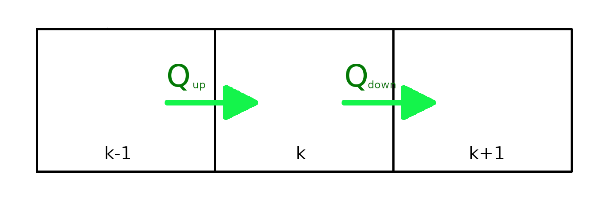
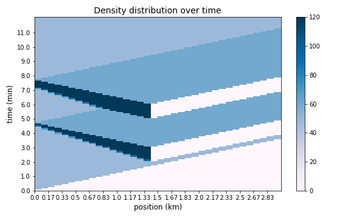

# Cell Transmission Model
### Numerical method to solve traffic flow system

The complex system of vehicular runoff is studied with different models. Some macroscopic, which consider traffic as a continuum fluid, and some microscopic, which consider the relation of a driver with adjacent vehicles.
Cell transmission model (CTM) is based on a class of macroscopic model called LWRs (Lighthill-Whitham-Richards model).

The variables of each macroscopic model are:
* flow
* density
* mean speed

which are connnected together by the hydrodynamic flow relation:

=\rho(x,t)v(x,t))

and also are subjected to a continuity equation:

The assunption of LWR models is that the flow is a funciton only of the density.

)

then:

The flow-density relation is called _fundamental diagram_.
 CTM uses the simplest form of fundamental diagram, which has a triangular form:
 
 
 
The diagram has only two derivatives, which correspond to the only two possible speeds of propagation of the traffic wave. Above a critical density the wave will move upstream.

The numerical method consist in a discretization of space and time, then a recursive algorithm is applied:
1. **compute _supply_ and _demand_ for each cell**

    &space;=&space;q_k(t)\qquad\rho&space;_k&space;>&space;\rho&space;_C)
    

    &space;=&space;C_k\qquad\rho&space;_k&space;\leq&space;\rho&space;_C)
    

    &space;=&space;q_k(t)\qquad\rho&space;_k&space;\leq&space;\rho&space;_C)
    

    &space;=&space;C_k\qquad\rho&space;_k&space;>&space;\rho&space;_C)
2. **determine flow at boundaries**

    )

    )

3. **update each cell density and total flow**

   &space;=&space;\rho&space;_k+\frac{\Delta&space;t}{\Delta&space;x_k}(q_k^{up}-q_k^{down}))

   &space;=&space;q_e(\rho&space;_k(t+\Delta&space;t)))
   

To modify the flow in the road, for example if we want to simulate a speed limit or a traffic light or some bottlenekcks in general, we act on the capacity _C_ of the cell. We will call the reduction in capacity _bottleneck strength_. 

# How to run a simulation
To start a simulation you have first to set the required parameters of the model which are divided in two section:
* model parameters (_**config.csv**_)
* bottlenecks parameters (_**bottlenecks.csv**_)

The necessary instructions are in the headers of the \*.csv files. Then you can already run _**simulation.py**_ and a plot with the density evolution of your road will be created as _filename.png_ in the **plots/** directory. If you will not pass a filename for your output, by just pressing enter, the file will be named using the current date.

**IMPORTANT:** the road is always empty at the beginning, and is filled up in time proportional to the speed prameter. 

### Others python files of the project

* **plot.py** only contains the function used to display the result
* **road.py** contains the two classes used by the simulation:

   _MakeRoad_ creates a road object, which has all the model parameters, and that will be filled with cells
  
   _MakeCell_ creates a cell object, which has instead the physical variables we use to determine the density evolution
* **config.py** has two functions for reading .csv files

**images/** is just a folder for images used in README.md

## Example
Here an example of simulation of a traffic light that turns red after 2 minute and after 5 minute.

start|end|strenght|time_i|time_f
-----|---|--------|------|------
1.5 km|1.5 km|1|2 min|3 min
1.5 km|1.5 km|1|5 min|6 min

road_length | density_max | free_v |mean_time_gap | simulation_time | source | sink
------------|-------------|--------|--------------|-----------------|--------|------
3 km | 120 veh/km | 50 km/h | 0.6 s | 0.2 h | 0.8 | 1

you can se how for the chosen source flow, the pause between the two red lights is not long enough for the traffic to flow out completely.
