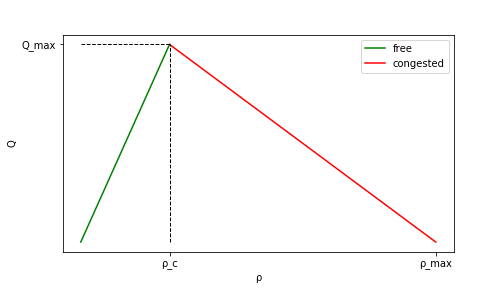

# Cell Transmission Model
### Numerical method to solve traffic flow system

The complex system of vehicular runoff is studied with different models. Some macroscopic, which consider traffic as a continuum fluid, and some microscopic, which consider the relation of a driver with adjacent vehicles.
Cell transmission model (CTM) is based on a class of macroscopic model called LWRs (Lighthill-Whitham-Richards model).

The variables of the each macroscopic model are:
* flow
* density
* mean speed

which are connnected together by the hydrodynamic flow relation:

=\rho(x,t)v(x,t))

and also are subjected to a continuity equation:

The assunption of LWR models is that the flow is a funciton only of the density. The flow-density raltion is called _fundamental diagram_.
 CTM uses the simplest form of fundamental diagram, which has a triangular form:
 
 
The numerical method consist in a discretization of space and time, obeying the Courant condition:

|)

which state that the speed of information is larger than the physical one.

Then a recursive algrithm is applied:
1. compute _supply_ and _demand_ for each cell
2. determine flow at boundaries
3. update each cell density and total flow
